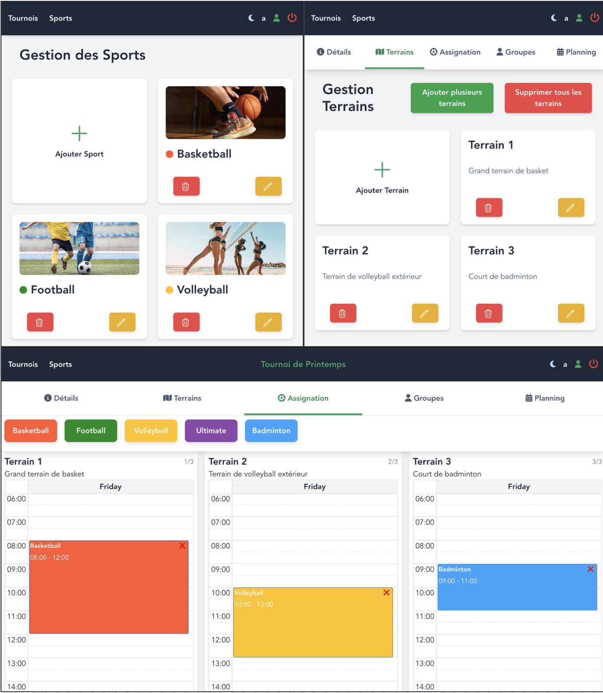

# EasyTourney (En cours de développement)

**EasyTourney** est une application de gestion de tournois sportifs, conçue pour les environnements scolaires et universitaires. Elle permet aux administrateurs de créer et de gérer des tournois, de suivre les matchs, d'assigner des sports à différents terrains, et de gérer les inscriptions des participants automatiquement. L'application est construite avec un système de rôles pour permettre une gestion sécurisée des utilisateurs et des permissions.



## Fonctionnalités

- Création d'une base de données représentant les différents sports disponibles.
- Création et gestion de tournois avec un nombre de terrains et de sports associés.
- Assignation des sports à des terrains avec la gestion des horaires.
- Inscription automatisée des joueurs et assignation aux groupes.
- Génération automatique d'un planning basé sur les groupes et les sports.
- Gestion des utilisateurs, tournois, sports, planning, et matchs.
- Vue globale des matchs et gestion de l'arbitrage.
- Suivi des scores et affichage des informations sur les matchs suivants.
- Design:
  - Mode Dark/Light en cliquant sur icone du menu.
  - L'application est responsive. Les interactions avec plannings et calendriers sur mobiles sont:
      - appuyer longtemps sur un sport de la liste pour le drag and drop
      - appuyer longtemps sur un sport dans un terrain pour le déplacer / modifier horaire
      - appuyer longtemps sur la croix d'un sport sur le terrain pour le supprimer (le sport doit être déselectionné
    

## Installation

### Prérequis

- **Node.js** (v14 ou supérieur recommandé)
- **MySQL** pour la base de données
- **NVM** (facultatif mais recommandé pour gérer plusieurs versions de Node.js)

### Instructions d'installation

1. **Cloner le dépôt** :
   ```bash
   git clone <url_du_dépôt>
   cd <nom_du_dossier>
   ```

2. **Installer les dépendances du backend et du frontend** :
   ```bash
   # Backend
   cd server
   npm install

   # Frontend
   cd ../frontend
   npm install
   ```
   Créez un fichier `.env` selon les fichiers env exemple à disposition.

3. **Database - migration & seeder** :
  Créer une base de données selon les informations du .env, créer les tables grâces aux migrations et des données fictives du seeder pour les tests.
  ```bash
  cd server/
  npm run db:hard reset
  ```

4. **Lancer l'application** :
   - **Backend** :
     ```bash
     cd server
     npm start
     ```

   - **Frontend** :
     ```bash
     cd ../frontend
     npm run serve
     ```

5. **Accéder à l'application** :
   Ouvrez votre navigateur et rendez-vous sur `http://localhost:8080` pour accéder à l'interface frontend.

## Utilisation
### Authentification

Avant de pouvoir interagir avec l'API, vous devez être authentifié. Voici un exemple de requête pour se connecter en tant qu'administrateur :

- **Login** :
  ```bash
  POST http://localhost:3000/api/auth/login
  Content-Type: application/json

  Body:
  {
    "email": "admin@example.com",
    "password": "password"
  }
  ```

  Une fois connecté, vous recevrez un token JWT. Utilisez ce token pour toutes les requêtes suivantes en l'incluant dans l'en-tête `Authorization` :

  ```
  Authorization: Bearer <votre_token_jwt>
  ```

### Exemple de requête API

- **Création d'un tournoi** :
  ```bash
  POST http://localhost:3000/api/tourneys
  Authorization: Bearer <votre_token_jwt>

  Body:
  {
    "name": "Tournoi Collège Ste-Croix 2024",
    "location": "Stade Saint-Léonard",
    "dateTourney": "2024-11-15",
    "emergencyDetails": "Contact : Professeur X, Tel: +12 34 567"
  }
  ```

## Déploiement

L'application est actuellement en cours de développement et fonctionne en local.

## Technologies Utilisées

- **Frontend** : Vue 3, Tailwind CSS (pour le style)
- **Backend** : Node.js, Express, Sequelize (ORM pour MySQL)
- **Base de données** : MySQL
- **Authentification** : JWT (JSON Web Tokens)

## Contribution

Les contributions sont les bienvenues ! Si vous souhaitez contribuer à EasyTourney, suivez ces étapes :

1. **Forkez le projet**
2. **Créez une nouvelle branche** : `git checkout -b feature/nom_de_la_fonctionnalité`
3. **Faites vos modifications**
4. **Soumettez une pull request**

## Auteurs

- **[Richoz Julien]** – Développeur principal

