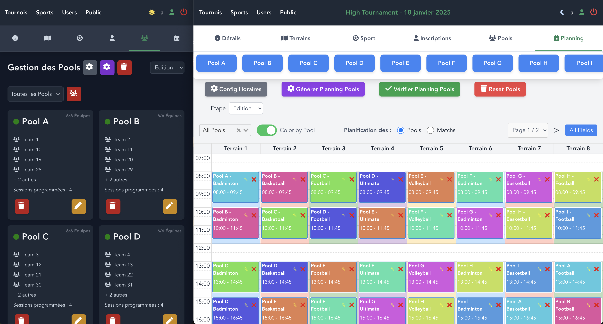

# EasyTourney (Under Development)

**Easy Tourney** is a web application designed to simplify the management and scheduling of sports tournaments in school and university environments. Built using Vue.js, Node.js, Express.js, MySQL via Sequelize, and adhering to MVC principles.

<figure align="center">
  
  <figcaption>Pools Management in DarkMode and Planning in LightMode</figcaption>
</figure>

## Installation
### Prerequisites
- **Node.js** (v14 or higher recommended)
- **MySQL** for the database
- **NVM** (optional but recommended for managing Node.js versions)

### Installation Steps
1. **Clone the repository**:
   ```bash
   git clone https://github.com/JulienRichoz/easy-tourney.git
   cd <folder_name>
   ```
2. **Install backend and frontend dependencies**:
   ```bash
   # Backend
   cd server
   npm install

   # Frontend
   cd ../frontend
   npm install
   ```
3. **Create a `.env` file** following the example `.env` files provided.

4. **Database - Migrations & Seeders**:
   - **Important:** To create a super-admin account (admin with ID 1), modify the seeder file `https://github.com/JulienRichoz/easy-tourney/blob/main/server/seeders/20241004122631-demo-users.js`.
   - **Note:** You may remove all seeders except `demo-roles` and `demo-users` for a functional application without test data.
   - Create the database as per the `.env` configuration, generate tables via migrations, and populate with seeders:
   ```bash
   cd server/
   npm run db:hard-reset
   ```

5. **Run the application**:
   - **Backend**:
     ```bash
     cd server
     npm run serve
     ```

   - **Frontend**:
     ```bash
     cd ../frontend
     npm run serve
     ```

6. **Access the application**:
   Open your browser and navigate to `http://localhost:8080` for the frontend interface.

## Features
- Database setup with seeders, including preloaded sports.
- Creation and management of custom tournaments:
  - Definition of playing fields.
  - Assignment of sports to fields with schedule management.
  - Automated player registration via a shareable invitation link, with group assignments.
  - Automatic schedule generation based on groups and sports.
  - User, tournament, sport, schedule, and match management.
- Comprehensive match overview and referee management.
- Real-time score tracking and updates on upcoming matches.

### Additional Features
- Export schedules and data in Excel format.
- User management system.
- Dark/Light mode toggle via menu icon.
- Fully responsive application. Mobile interactions for schedules and calendars:
  - Long press a sport in the list to drag and drop it onto a field.
  - Long press a sport on a field to move or edit its schedule.
  - Long press the cross on a field to delete a sport (the sport must first be deselected).

## Run POSTMAN Tests
1. **Install newman**:
   ```bash
   npm install -g newman
   ```
2. From the root folder (`easy-tourney/`), execute:
   ```bash
   newman run ./server/tests/collection.json --environment ./server/tests/environment.json
   ```

### API Testing with POSTMAN
To interact with the API, you must be authenticated. Example of logging in as an admin using POSTMAN:
- **Login**:
  ```bash
  POST http://localhost:3000/api/auth/login

  Content-Type: application/json
  Body:
  {
    "email": "a@a.a",
    "password": "password"
  }
  ```

  Once logged in, you’ll receive a JWT token. Include this token in the `Authorization` header for subsequent requests:
  ```
  Authorization: Bearer <your_jwt_token>
  ```

### API Request Example
- **Create a Tournament**:
  ```bash
  POST http://localhost:3000/api/tourneys
  Authorization: Bearer <your_jwt_token>

  Body:
  {
    "name": "College Ste-Croix Tournament 2024",
    "location": "Saint-Léonard Stadium",
    "dateTourney": "2024-11-15",
    "emergencyDetails": "Contact: Professor X, Phone: +12 34 567"
  }
  ```

## Technologies Used

- **Frontend**: Vue 3, Tailwind CSS (for styling)
- **Backend**: Node.js, Express, Sequelize (ORM for MySQL)
- **Database**: MySQL
- **Authentication**: JWT (JSON Web Tokens)

## Contribution
Contributions are welcome! If you’d like to contribute to EasyTourney, follow these steps:

1. **Fork the project**
2. **Create a new branch**: `git checkout -b feature/feature_name`
3. **Make your changes**
4. **Submit a pull request**

## Authors

- **[Richoz Julien]** – Lead Developer
